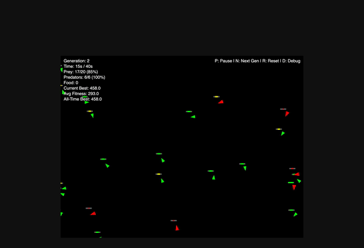

# Predator vs Prey Simulation



An evolutionary predator-prey simulation built with p5.js and TypeScript, featuring autonomous agents with ray-casting vision and genetic algorithm-based evolution.

## Overview

This simulation models predator-prey dynamics where prey seek food while evading predators, and predators hunt prey. Entities evolve over generations using tournament selection, with fitness based on survival time and resource acquisition.

## Features

- **Vision System**: Ray-casting algorithm allows entities to detect objects within their field of view
- **Genetic Evolution**: Entities evolve traits like FOV angle, view distance, max speed, and behavioral weights
- **Prey (Green)**: Seek food sources, flee from predators, evolve survival traits
- **Predators (Red)**: Hunt prey using pursuit behaviors, evolve hunting efficiency
- **Health System**: Entities lose health over time and must eat to survive
- **Generation System**: Populations evolve using tournament selection with mutation
- **Fitness Tracking**: Based on time alive, food eaten, and prey caught

## Running the Simulation

```bash
npm install
npm run dev
```

Open http://localhost:3000 in your browser.

## Controls

| Key | Action |
|-----|--------|
| D | Toggle debug mode (shows vision rays) |
| P | Pause/Resume simulation |
| N | Next generation (manual) |
| R | Reset simulation |

## Genome System

Each entity has a genome controlling behavior through these genes:

| Gene | Description |
|------|-------------|
| `fovAngle` | Field of view angle (30-360°) |
| `viewDistance` | How far entity can see (100-500) |
| `maxSpeed` | Maximum velocity (1-4) |
| `maxForce` | Steering force limit (0.05-0.3) |
| `wanderWeight` | Importance of wandering |
| `seekWeight` | Importance of seeking targets |
| `fleeWeight` | Importance of fleeing (prey) |
| `huntWeight` | Importance of hunting (predators) |

## Configuration

Edit `src/config.ts` to adjust simulation parameters:

- Population sizes (prey: 20, predators: 6)
- Food regeneration (80 initial, regenerates every 30 frames)
- Generation duration (2400 frames)
- Mutation rate (15%)

## Architecture

| File | Description |
|------|-------------|
| `src/main.ts` | Entry point, p5.js setup() and draw() loop |
| `src/world.ts` | World container and generation management |
| `src/entity.ts` | Entity classes (Pray, Pred) with behaviors |
| `src/ray.ts` | Ray-casting vision system |
| `src/food.ts` | Food source objects |
| `src/genome.ts` | Genome class for genetic evolution |
| `src/generation.ts` | Generation manager with tournament selection |
| `src/config.ts` | Configuration constants |

## Future Improvements

- [ ] Neural network approach for brain (simple perceptron)
